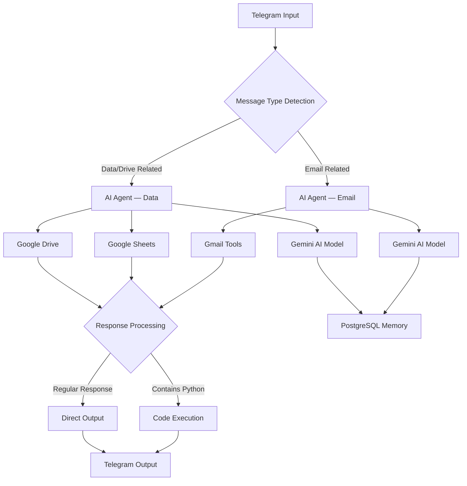

<div align="center">


<br/>


<br/>

<a href="https://github.com/Amin-Moniry"></a>
<a href="https://ollama.ai"></a>
<a href="https://gemini.google.com"></a>
<a href="https://telegram.org"></a>
<a href="https://ngrok.com"></a>
<a href="https://docs.microsoft.com/en-us/windows/wsl/"></a>
<a href="https://python.org"></a>

<br/><br/>


</div>

---

<div align="center">

## `◈` Overview

</div>

<div align="center">

**Amin's Smart Assistant** is an intelligent Telegram bot that connects Gmail, Google Drive, Google Sheets, and multiple AI models into a single unified command interface. Built on **n8n** automation with **Docker** on **WSL2**, the system routes incoming messages through dual specialized AI agents — each equipped with distinct tools, memory, and reasoning models — transforming any Telegram conversation into a full-featured productivity hub.

The bot targets power users, developers, and teams who need a portable, self-hosted automation layer over their Google Workspace. It supports natural language email composition, spreadsheet queries, Drive browsing, Python code execution, persistent conversation memory via PostgreSQL, and bilingual interaction in English and Persian — all delivered through a single Telegram interface.

</div>

<br/>


---

<div align="center">

## `◈` Features


<small>

| <sub>`▶` Feature</sub> | <sub>Description</sub> | <sub>Status</sub> |
|:-----------------------:|:----------------------:|:-----------------:|
| <sub>Dual AI Agents</sub> | <sub>Email Agent and Data Agent — each with specialized tools and Gemini 2.0 Flash reasoning</sub> | <sub>✅</sub> |
| <sub>Gmail Integration</sub> | <sub>Send and retrieve emails through natural language commands via Telegram</sub> | <sub>✅</sub> |
| <sub>Google Sheets</sub> | <sub>Read, analyze, and display spreadsheet data with row/column targeting</sub> | <sub>✅</sub> |
| <sub>Google Drive</sub> | <sub>Search files, browse folder structures, and retrieve storage analytics</sub> | <sub>✅</sub> |
| <sub>Memory System</sub> | <sub>PostgreSQL-backed persistent conversation memory with cross-session context</sub> | <sub>✅</sub> |
| <sub>Python Execution</sub> | <sub>Detect and execute Python code snippets with intelligent keyword routing</sub> | <sub>✅</sub> |
| <sub>Smart Routing</sub> | <sub>Automatic message classification — email, data, or code — before agent dispatch</sub> | <sub>✅</sub> |
| <sub>Multi-Language</sub> | <sub>Full English and Persian (فارسی) support with context-aware responses</sub> | <sub>✅</sub> |
| <sub>Ollama Local AI</sub> | <sub>Qwen 3:4B running locally via Docker with GPU acceleration</sub> | <sub>✅</sub> |
| <sub>Webhook Tunneling</sub> | <sub>ngrok secure tunneling for Telegram webhook on local WSL2 deployment</sub> | <sub>✅</sub> |
| <sub>Rich Media Support</sub> | <sub>Images, documents, and voice message handling</sub> | <sub>⏳</sub> |
| <sub>Analytics Dashboard</sub> | <sub>Usage metrics and performance monitoring panel</sub> | <sub>⏳</sub> |

</small>

</div>

<br/>


---

<div align="center">

## `◈` Architecture


</div>



<br/>


---

<div align="center">

## `◈` Tech Stack

| Layer | Technologies |
|:-----:|:------------:|
| **Automation Engine** | n8n — self-hosted workflow orchestration |
| **AI Models** | Gemini 2.0 Flash · Qwen 3:4B via Ollama |
| **Messaging** | Telegram Bot API — webhook-based real-time updates |
| **Google Workspace** | Gmail API · Google Sheets API · Google Drive API |
| **Infrastructure** | Docker · WSL2 (Ubuntu) · ngrok tunneling |
| **Memory & Storage** | PostgreSQL — persistent session and context storage |
| **Language** | Python 3 — code execution and backend logic |
| **Auth** | OAuth2 — Google services authentication |

</div>

<br/>


---

## `◈` Project Structure


```
smart-telegram-bot/
│
├── n8n_amin_workflow.json        ← Main n8n workflow export (import this)
├── requirements.txt              ← Python dependencies
├── .env.example                  ← Environment variable template
│
├── Image/
│   ├── n8n_1.png                 ← n8n workflow UI preview
│   └── ...
│
├── docs/
│   └── setup.md                  ← Extended configuration notes
│
└── LICENSE
```

<br/>


---

## `◈` Installation


 &nbsp; Install WSL2 with Ubuntu and Docker.

```bash
# Install WSL2 with Ubuntu
wsl --install -d Ubuntu

# Install Docker in WSL2
curl -fsSL https://get.docker.com -o get-docker.sh
sudo sh get-docker.sh

# Start Docker service
sudo service docker start
```

 &nbsp; Run Ollama container and pull the Qwen model.

```bash
# Pull and run Ollama with GPU support
docker run -d --gpus=all -v ollama:/root/.ollama -p 11434:11434 --name ollama ollama/ollama

# Install Qwen 3:4B model
docker exec -it ollama ollama pull qwen3:4b
```

 &nbsp; Install and configure ngrok for Telegram webhook tunneling.

```bash
# Install ngrok
curl -s https://ngrok-agent.s3.amazonaws.com/ngrok.asc | sudo tee /etc/apt/trusted.gpg.d/ngrok.asc >/dev/null
echo "deb https://ngrok-agent.s3.amazonaws.com buster main" | sudo tee /etc/apt/sources.list.d/ngrok.list
sudo apt update && sudo apt install ngrok

# Authenticate and expose n8n
ngrok authtoken YOUR_NGROK_TOKEN
ngrok http 5678
```

 &nbsp; Launch n8n with PostgreSQL via Docker.

```bash
docker run -d \
  --name n8n \
  -p 5678:5678 \
  -e DB_TYPE=postgresdb \
  -e DB_POSTGRESDB_HOST=postgres \
  -e DB_POSTGRESDB_DATABASE=n8n \
  -v n8n_data:/home/node/.n8n \
  --link postgres:postgres \
  n8nio/n8n
```

 &nbsp; Import the n8n workflow JSON.

```bash
curl -X POST "your-ngrok-url.ngrok.io/api/v1/workflows/import" \
  -H "Content-Type: application/json" \
  -d @n8n_amin_workflow.json
```

 &nbsp; Set up all service credentials inside n8n.

- Telegram Bot API token with ngrok webhook URL
- Google OAuth2 for Gmail, Sheets, and Drive
- PostgreSQL connection string
- Ollama API endpoint: `http://localhost:11434`

 &nbsp; Connect all containers to a shared Docker network.

```bash
docker network create n8n-network
docker network connect n8n-network ollama
docker network connect n8n-network postgres
docker network connect n8n-network n8n
```

<br/>


---

## `◈` Configuration


**Telegram Bot**
```javascript
{
  "telegramApi": {
    "accessToken": "YOUR_BOT_TOKEN",
    "baseURL": "https://api.telegram.org"
  }
}
```

**Ollama Local AI**
```javascript
{
  "ollamaApi": {
    "baseURL": "http://localhost:11434",
    "model": "qwen3:4b"
  }
}
```

**ngrok Webhook**
```javascript
{
  "webhookUrl": "https://your-tunnel.ngrok.io/webhook/telegram",
  "allowedUpdates": ["message"]
}
```

<br/>


---

## `◈` Usage Examples


**Email Operations**
```
User  → "Send an email to john@example.com about tomorrow's meeting"
Bot   → Email composed and dispatched via Gmail API.
        Subject auto-generated. Sender attribution applied.
        ✅ Delivered to john@example.com
```

**Spreadsheet Query**
```
User  → "Show me the latest data from my spreadsheet"
Bot   → Fetched 25 rows from active sheet.
        Columns parsed and formatted for Telegram output.
        ✅ Data retrieved successfully
```

**Python Execution**
```
User  → "Write a Python script to calculate fibonacci"
Bot   → Code generated, sandboxed, and executed.
        Output returned with performance note.
        ✅ Script ran successfully
```

<br/>


---

## `◈` Advanced Features


**Smart Message Detection** — The routing layer classifies every incoming message before dispatching it. Email keywords (`message`, `پیام`, `messag`), Python keywords (`python`, `پایتون`, `pyton`), and context from prior messages all influence which agent receives the task.

**Response Enhancement** — Every reply is post-processed: thinking tokens are stripped, emoji are placed meaningfully, the user's first name is injected, and the signature `𝑨𝒎𝒊𝒏 💛 𝑴𝒐𝒏𝒊𝒓𝒚` is appended automatically.

**Memory Architecture** — PostgreSQL stores full session history. Each agent reads from and writes to the same memory pool, enabling coherent multi-turn conversations across separate sessions without repeated context.

**Model Selection** — Gemini 2.0 Flash handles reasoning-heavy tasks; Qwen 3:4B serves fast local completions via Ollama. The routing logic selects the appropriate model based on task complexity and latency requirements.

<br/>


---

<div align="center">

## `◈` Performance

<small>

| <sub>Component</sub> | <sub>Response Time</sub> | <sub>Accuracy</sub> | <sub>Uptime</sub> | <sub>Environment</sub> |
|:--------------------:|:------------------------:|:-------------------:|:-----------------:|:----------------------:|
| <sub>Telegram Webhook (ngrok)</sub> | <sub>&lt;100ms</sub> | <sub>99.9%</sub> | <sub>99.9%</sub> | <sub>WSL2 Docker</sub> |
| <sub>AI Agent Processing</sub> | <sub>&lt;2s</sub> | <sub>95%</sub> | <sub>99.5%</sub> | <sub>Ollama Local</sub> |
| <sub>Gmail Operations</sub> | <sub>&lt;3s</sub> | <sub>98%</sub> | <sub>99.8%</sub> | <sub>Google API</sub> |
| <sub>Google Drive Access</sub> | <sub>&lt;1s</sub> | <sub>99%</sub> | <sub>99.9%</sub> | <sub>Google API</sub> |
| <sub>Memory Retrieval</sub> | <sub>&lt;200ms</sub> | <sub>100%</sub> | <sub>99.9%</sub> | <sub>PostgreSQL</sub> |

</small>

</div>

<br/>


---

## `◈` Troubleshooting


**Bot not responding**
```bash
# Verify webhook is registered
curl -X GET "https://api.telegram.org/bot{TOKEN}/getWebhookInfo"
# Confirm n8n workflow is active and Telegram trigger node is connected
```

**Gmail authentication errors**
```bash
# Refresh OAuth2 tokens in n8n credentials
# Verify all required scopes in Google Cloud Console
# Check credential expiration date
```

**ngrok tunnel disconnected**
```bash
# Restart with stable connection
ngrok http 5678 --region=us --log=stdout

# Re-register Telegram webhook with new URL
curl -X POST "https://api.telegram.org/bot{TOKEN}/setWebhook" \
  -H "Content-Type: application/json" \
  -d '{"url":"https://new-tunnel.ngrok.io/webhook/telegram"}'
```

**Ollama not responding**
```bash
# Check container status
docker ps | grep ollama

# Restart and verify model
docker restart ollama
curl http://localhost:11434/api/generate -d '{"model":"qwen3:4b","prompt":"test"}'
```

**WSL2 Docker issues**
```bash
sudo service docker restart
docker --version
wsl --list --verbose
```

<br/>


---

## `◈` Roadmap


- [ ] Rich media handling — images, documents, and voice messages
- [ ] Multi-language expansion — Arabic, Turkish, and more
- [ ] GPT-4 integration as an optional reasoning backend
- [ ] Analytics dashboard for usage metrics and agent performance
- [ ] Additional service integrations — Notion, Slack, Trello
- [ ] Mobile-facing webhook layer for third-party app triggers

<br/>


---

## `◈` Contributing

1. Fork the repository via the **Fork** button on GitHub.
2. Create a feature branch: `git checkout -b feature/your-feature-name`
3. Commit with a descriptive message: `git commit -m "Add: brief description"`
4. Push to your fork: `git push origin feature/your-feature-name`
5. Open a **Pull Request** against the `master` branch of this repository.

<br/>


---

<div align="center">

## `◈` License

This project is licensed under the **MIT License**.

Any forks or distributions must retain credit to **Amin Moniry (AminTivanix2)** as the original author. See [LICENSE](LICENSE) for complete terms.

`©` 2025 Amin Moniry (AminTivanix2) — All Rights Reserved

</div>

<br/>


---

<div align="center">

## `◈` Screenshots


*`▶` n8n workflow — dual agent routing with Gmail, Sheets, Drive, and memory nodes*

</div>

<br/>


---

<div align="center">

## `◈` Contact

<br/>


<br/>

<table>
<tr>
<td align="center" width="210">
<a href="https://github.com/Amin-Moniry">

</a>
</td>
<td align="center" width="210">
<a href="https://t.me/amintivanix2">

</a>
</td>
<td align="center" width="210">
<a href="mailto:amintivanix2@gmail.com">

</a>
</td>
</tr>
<tr>
<td align="center" width="210">
<a href="https://allin1wrench.ir">

</a>
</td>
<td align="center" width="210" colspan="2">
<a href="https://github.com/Amin-Moniry/CAMERA_PROJECT-WITH_QUEUE_TREADING_DATABASE/issues">

</a>
</td>
</tr>
</table>

</div>

<br/>


<div align="center">

<br/>


<br/>


</div>
